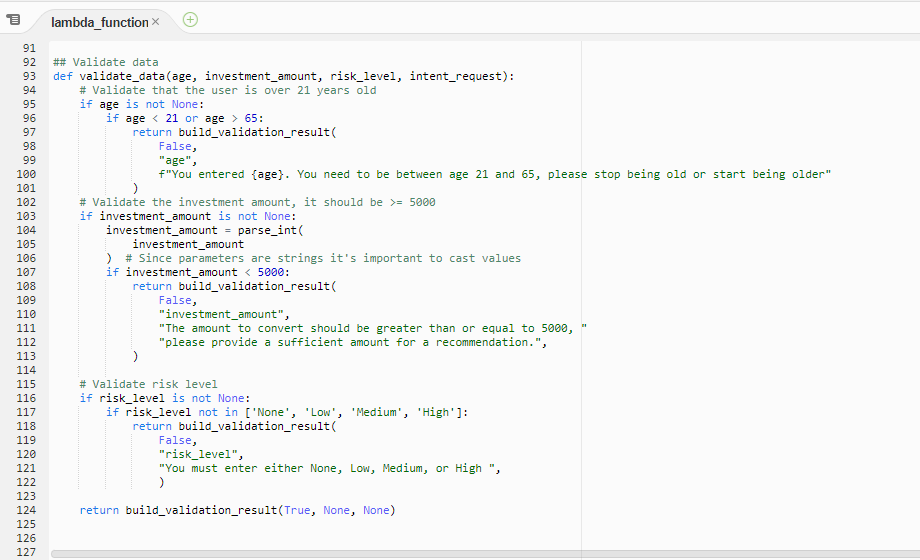
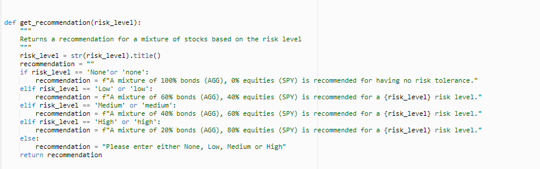
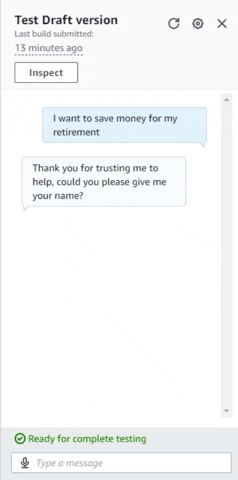

# AWS_Robo_Adviser
Lex bot created using AWS Lex and Lambda functions to deliver an automated chat service detailing risk on an investment.

---

## Technologies

Language: Python 

[Amazon Lex](https://aws.amazon.com/lex/) - AWS service for creating automated chat bots

[Amazon Lambda](https://aws.amazon.com/lambda/) - AWS service for creating complex functions for use in other AWS services such as Lex

---

## Installation Guide

There is nothing to install as Amazon Web Services are accessed through **[aws.amazon.com](aws.amazon.com)**

---

## Usage and overview

I have not published this bot so there is no public usage at this point. There are GIFs below showing how it works.

Ultimately the user inputs their first name, age, amount for investment and their risk level, this bot will only work between the ages of 21 and 65.

The bot stores this information and recommends a split of bonds (AGG) and/or stocks (SPY)

---
## Lambda function

---

## Gifs of Bot Working

### Test

### Full Build

.gif)

---
## Contributors

Created by Austin Means while in the UW FinTech Bootcamp
> Contact Info:
> email: austinmeans92@gmail.com|
> 
> [GitHub] (https://github.com/aimeans) |